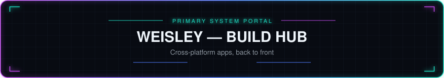
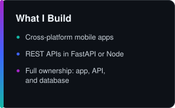
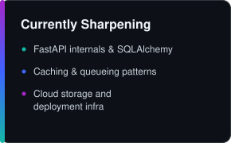
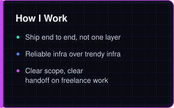
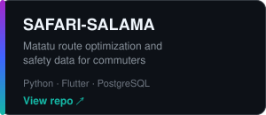
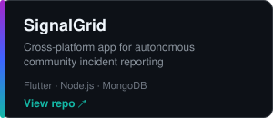
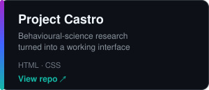

<!-- Waving header banner -->

<!-- Animated typing headline -->

  

  
  
  
  

<table width="100%">
<tr>
<td width="33.33%"></td>
<td width="33.33%"></td>
<td width="33.33%"></td>
</tr>
</table>

## About Me

I build cross-platform apps end to end. Flutter and Dart on the front, Python or Node on the back, Postgres underneath.

- 🔭 Currently working on **YelenImport**
- 🌱 Sharpening **FastAPI, SQLAlchemy**
- 📫 Reach me at **weisleyalmond@outlook.com**

## Open to Collaborate On

- Cross-platform mobile apps built in Flutter and Dart
- Backend APIs with FastAPI or Node.js + Express
- Full-stack builds where I own both the app and the API behind it
- Freelance or contract app work

## 🌐 Connect with me

## 🛠️ Tech Stack

<table width="100%">
<tr><td align="center" colspan="4"><b>Mobile</b></td></tr>
<tr>
<td align="center" width="25%"> Flutter</td>
<td align="center" width="25%"> Dart</td>
<td align="center" width="25%"> Kotlin</td>
<td align="center" width="25%"> React Native</td>
</tr>
<tr><td align="center" colspan="4"><b>Backend</b></td></tr>
<tr>
<td align="center" width="25%"> Python</td>
<td align="center" width="25%"> FastAPI</td>
<td align="center" width="25%"> Flask</td>
<td align="center" width="25%"> Django</td>
</tr>
<tr>
<td align="center" width="25%"> Node.js</td>
<td align="center" width="25%"> Express</td>
<td width="25%"></td>
<td width="25%"></td>
</tr>
<tr><td align="center" colspan="4"><b>Database &amp; Cloud</b></td></tr>
<tr>
<td align="center" width="25%"> Postgres</td>
<td align="center" width="25%"> Google Cloud</td>
<td align="center" width="25%"> Cloudflare</td>
<td width="25%"></td>
</tr>
<tr><td align="center" colspan="4"><b>Deployment</b></td></tr>
<tr>
<td align="center" width="25%"> Vercel</td>
<td align="center" width="25%"> Render</td>
<td align="center" width="25%"> Netlify</td>
<td align="center" width="25%"> Railway</td>
</tr>
<tr><td align="center" colspan="4"><b>Tools</b></td></tr>
<tr>
<td align="center" width="25%"> Postman</td>
<td width="25%"></td>
<td width="25%"></td>
<td width="25%"></td>
</tr>
<tr><td align="center" colspan="4"><b>Cache &amp; Queue</b></td></tr>
<tr>
<td align="center" width="25%"> Redis</td>
<td align="center" width="25%"> RabbitMQ</td>
<td width="25%"></td>
<td width="25%"></td>
</tr>
<tr><td align="center" colspan="4"><b>Storage</b></td></tr>
<tr>
<td align="center" width="25%"> AWS S3</td>
<td align="center" width="25%"> Cloudinary</td>
<td align="center" width="25%"> MinIO</td>
<td width="25%"></td>
</tr>
<tr><td align="center" colspan="4"><b>Auth</b></td></tr>
<tr>
<td align="center" width="25%"> JWT / OAuth2</td>
<td align="center" width="25%"> Firebase Auth</td>
<td width="25%"></td>
<td width="25%"></td>
</tr>
<tr><td align="center" colspan="4"><b>Payments</b></td></tr>
<tr>
<td align="center" width="25%"> Stripe</td>
<td align="center" width="25%"> PayPal</td>
<td align="center" width="25%"> Razorpay</td>
<td width="25%"></td>
</tr>
<tr><td align="center" colspan="4"><b>SMS &amp; Email</b></td></tr>
<tr>
<td align="center" width="25%"> Twilio</td>
<td align="center" width="25%"> SendGrid</td>
<td width="25%"></td>
<td width="25%"></td>
</tr>
</table>

**Also work with:** JavaScript · Java · HTML/CSS

## Featured Projects

<table width="100%">
<tr>
<td width="33.33%"></td>
<td width="33.33%"></td>
<td width="33.33%"></td>
</tr>
</table>

Full write-ups, stack notes, and repo links → [PROJECTS.md](./PROJECTS.md)

## GitHub Stats

<picture>
  <source media="(prefers-color-scheme: dark)" srcset="./profile/snake-dark.svg" />
  <source media="(prefers-color-scheme: light)" srcset="./profile/snake.svg" />
  
</picture>

<!-- Waving footer banner -->

[ found something?](./EASTER_EGG.md)
